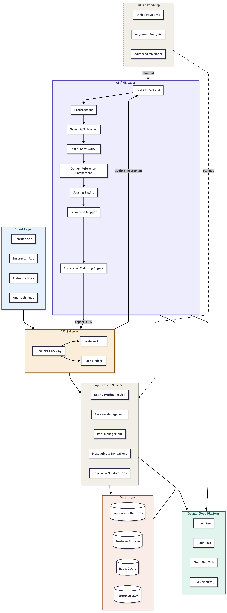

# Canva Cloud AI Architecture

## Link to Canva Cloud AI portfolio:
```bash
https://www.canvascloud.ai/gallery/tuneacademy-on-gcp
```


### Description of GCP Architecture

TuneAcademy's cloud architecture is built in 6 layers that all work together seamlessly.

The client layer is the React web app used by both learners and instructors, handling everything from audio recording to the Musireels feed and session scheduling. All requests from the app flow through an API Gateway backed by Firebase Auth, which verifies every user and enforces whether they are a learner or instructor before anything else happens.

Verified requests then hit the application services layer, which is a set of independent backend services handling profiles, sessions, reels, messaging, reviews, and notifications. When a learner submits a recording specifically, that audio takes a separate path directly into the AI layer, which is a Dockerized FastAPI Python backend running on Google Cloud Run. Inside that container, the audio gets preprocessed, run through Essentia for feature extraction, routed by instrument type, compared against the golden reference files, scored across five dimensions, and finally mapped to plain-English weaknesses and matched instructor suggestions before the report gets sent back to the app.

All data produced by both the application services and the AI layer is persisted in Cloud Firestore, with Firebase Storage handling video and audio assets, and a Redis cache keeping the Musireels feed fast. Sitting underneath everything is Google Cloud Platform, providing Cloud Run for the containerized backend, Cloud CDN for global video delivery, Cloud Pub/Sub for event streaming between services, and IAM for role-based security across the whole system.

### Mermaid Code
```bash
flowchart TD
    subgraph CLIENT["Client Layer"]
        A1[Learner App] & A2[Instructor App] & A3[Audio Recorder] & A4[Musireels Feed]
    end

    subgraph GATEWAY["API Gateway"]
        B1[REST API Gateway] --> B2[Firebase Auth] & B3[Rate Limiter]
    end

    subgraph APP["Application Services"]
        C1[User & Profile Service]
        C2[Session Management]
        C3[Reel Management]
        C4[Messaging & Invitations]
        C5[Reviews & Notifications]
    end

    subgraph AI["AI / ML Layer"]
        D1[FastAPI Backend]
        D2[Preprocessor]
        D3[Essentia Extractor]
        D4[Instrument Router]
        D5[Golden Reference Comparator]
        D6[Scoring Engine]
        D7[Weakness Mapper]
        D8[Instructor Matching Engine]
    end

    subgraph DATA["Data Layer"]
        E1[(Firestore Collections)]
        E2[(Firebase Storage)]
        E3[(Redis Cache)]
        E4[(Reference JSON)]
    end

    subgraph GCP["Google Cloud Platform"]
        F1[Cloud Run]
        F2[Cloud CDN]
        F3[Cloud Pub/Sub]
        F4[IAM & Security]
    end

    subgraph FUTURE["Future Roadmap"]
        G1[Stripe Payments]
        G2[Any-song Analysis]
        G3[Advanced ML Model]
    end

    CLIENT --> GATEWAY
    GATEWAY --> APP
    GATEWAY -->|audio + instrument| D1
    D1 --> D2 --> D3 --> D4 --> D5 --> D6 --> D7 --> D8
    D8 -->|report JSON| GATEWAY
    APP --> DATA
    AI --> DATA
    APP & AI --> GCP
    FUTURE -.->|planned| APP
    FUTURE -.->|planned| AI

    style AI fill:#EEEDFE,stroke:#534AB7,color:#26215C
    style FUTURE fill:#F1EFE8,stroke:#888780,stroke-dasharray:5 5,color:#444441
    style GCP fill:#E1F5EE,stroke:#0F6E56,color:#085041
    style CLIENT fill:#E6F1FB,stroke:#185FA5,color:#0C447C
    style GATEWAY fill:#FAEEDA,stroke:#854F0B,color:#633806
    style APP fill:#F1EFE8,stroke:#5F5E5A,color:#2C2C2A
    style DATA fill:#FAECE7,stroke:#993C1D,color:#712B13
```

### Mermaid Results:
